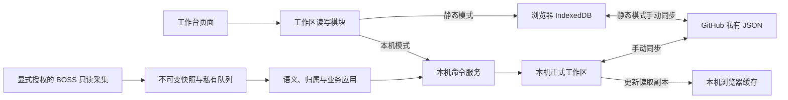
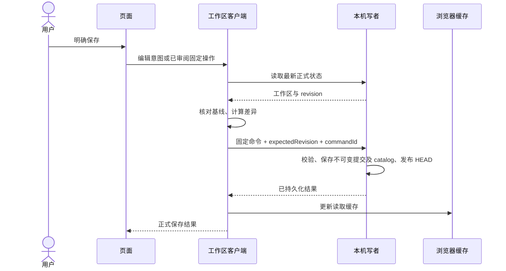
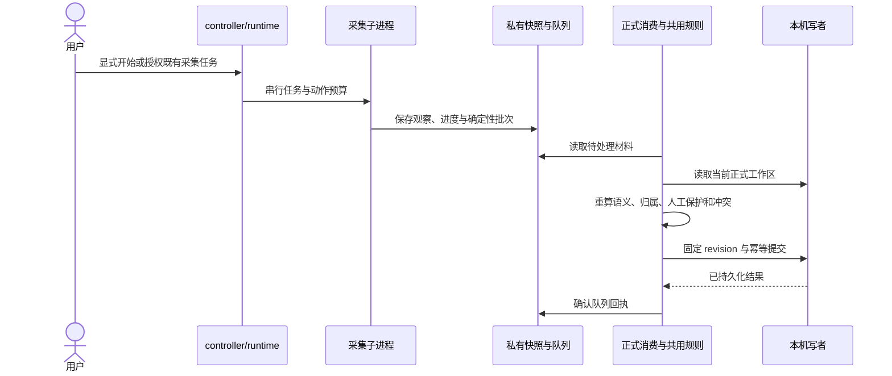

# 当前系统架构

本文描述当前实现：运行结构、模块职责、数据所有者与关键流程。本次整理核对的代码基线为 `6fd11e4`，应用为 0.10.17；当前格式版本以[数据与恢复](DATA_AND_RECOVERY.md#版本与两种存储模式)为准。历史决定及替代关系保留在 [ADR 索引](DECISIONS.md)，后续工作见[架构重构清单](ARCHITECTURE_REFACTOR_PLAN.md)。

## 阅读入口

| 要了解的内容                       | 对应文档                                               |
| ---------------------------------- | ------------------------------------------------------ |
| 术语及事实与判断的区别             | [CONTEXT.md](../CONTEXT.md)                            |
| 当前结构、职责和数据流             | 本文                                                   |
| 采集授权与只读边界                 | [自动化规约](AUTOMATION_POLICY.md)                     |
| BOSS 命令、预算与采集恢复          | [BOSS 接入设计](BOSS_AUTOMATION_DESIGN.md)             |
| 格式迁移、正式提交、同步与恢复细则 | [数据与恢复](DATA_AND_RECOVERY.md)                     |
| 启动、发布、排障与人工验收         | [维护手册](MAINTENANCE.md)                             |
| 历史原因与版本变更                 | [决策索引](DECISIONS.md)、[CHANGELOG](../CHANGELOG.md) |

## 运行方式

界面使用静态 HTML/CSS/ES modules；`dist/` 是直接维护的公开源码，也是唯一公开部署目录，没有构建阶段。Node 24 运行本机服务和采集子进程，pnpm 与依赖版本由 `package.json` 和锁文件固定。运行代码没有第三方包依赖，Prettier 和 Playwright 用于开发检查。

| 模式          | 正式数据由谁保存                                   | 浏览器的角色                                               | 服务不可用时                                 |
| ------------- | -------------------------------------------------- | ---------------------------------------------------------- | -------------------------------------------- |
| 本机模式      | Node 服务在 `.local/workspace/` 保存唯一正式工作区 | IndexedDB 是读取缓存，页面通过固定命令保存；草稿留在浏览器 | 读取已有缓存、保留草稿；正式写入等待服务恢复 |
| 静态/手机模式 | 当前浏览器的 IndexedDB                             | IndexedDB 事务保存正式记录，草稿另存 localStorage          | 不依赖本机工作区服务                         |

两种模式通过用户明确发起的 GitHub 同步交换共享数据。已采用本机模式后，连接失败不能自动改为静态写入；已有不同缓存或工作区身份时，先备份并明确切换。首次迁移及身份保护见 [D026](adr/0026-local-authoritative-workspace.md) 与[数据与恢复](DATA_AND_RECOVERY.md#首次迁移与版本保护)。

图中的工作区与 GitHub 连线表示同步结果关系，实际传输由 REST 或本机 SSH adapter 完成。BOSS 采集器与工作台服务使用独立进程；服务启动可处理已有本机材料，不能授权平台访问或恢复此前跟踪。

## 模块职责

### 五个职责组

| 职责组          | 当前主要模块                                                                                             | 对调用者提供的能力                                   |
| --------------- | -------------------------------------------------------------------------------------------------------- | ---------------------------------------------------- |
| 页面交互        | `app.js`、`app-startup.js`、`views.js`、`settings-view.js`、`ui.js`、`text-input.js`                     | 启动、渲染、表单、导航、输入与操作反馈               |
| 共用业务规则    | `model.js`、`jobs.js`、`today.js`、`daily.js`、`planning.js`、BOSS 规则模块                              | 校验、查询、合并、业务含义、归属和应用结果           |
| BOSS 采集与交付 | `collector/boss/`、`boss-controller.mjs`、`boss-runtime.mjs`、`boss-integration.mjs`、`boss-inbox.mjs`   | 显式调度、预算、取材、进度保存、确定性批次及入队     |
| 工作区存储      | `storage.js`、`local-workspace.js`、`workspace-api.mjs`、`workspace-store.mjs`、`workspace-consumer.mjs` | 模式路由、固定命令、单写者提交、幂等、队列消费与回执 |
| 同步与恢复      | `github.js`、`local-ssh.js`、`ssh-store.mjs`、`workspace.js`、备份和草稿模块                             | 手动同步、备份、恢复、冲突核对与草稿准备             |

表中浏览器 `.js` 位于 `dist/`，服务 `.mjs` 位于 `scripts/`。这些是当前职责分组；一个文件可能覆盖多个职责，后续分离项另列于重构清单。

### 规则与适配的实际位置

| 事项               | 唯一规则或主要实现                                                           | 调用者与保留条件                                                 |
| ------------------ | ---------------------------------------------------------------------------- | ---------------------------------------------------------------- |
| 岗位查询与行动建议 | `jobs.js`、`today.js`、`daily.js`、`planning.js`                             | 页面与详情共用纯查询；日期查询展示当前岗位信息，不推断历史阶段   |
| 简历语义与状态转换 | `resume-rules.js`；联动规则在 `model.js`                                     | 采集、转换、应用与展示共用；识别结果不授予归属或人工字段所有权   |
| 岗位资料证据       | `collector/boss/job-evidence.mjs`、`boss-detail-title.js`、`boss-job-url.js` | 采集展示、详情交付和旧身份映射共用；三种用途的兼容语义分别保留   |
| 归属判断           | `boss-attribution.js`                                                        | 对各完整观察独立核对；上下文按当前材料构建，候选不等于已确认归属 |
| 批次与来源身份     | `boss-batch.js`、`source-identity.js`                                        | 校验与稳定 ID 共用；旧事件身份不随规则升级改写                   |
| 应用与人工决定     | `boss-integration.js`、`boss-observations.js`、`source-ledger.js`            | 正式消费和固定人工命令执行规则；事实与应用决定分别保存           |
| 本机命令交付       | `local-workspace.js`                                                         | 普通编辑与固定操作共用串行、revision、精确重试及缓存更新         |
| 采集阶段提交       | `collector/boss/history-commit.mjs`                                          | 证据、进度和检查点按已定义顺序保存；保存失败不能确认配套进度     |
| 服务启动与身份     | `service-control.mjs`、`service-runtime.mjs`、`serve.mjs`                    | 共用健康检查；`doctor.mjs` 读取已验证结果，不另行猜测身份        |

`boss-integration.js` 当前同时包含纯应用函数和浏览器连接、队列状态 adapter；`app.js` 当前仍编排岗位编辑、详情导航及同步。文档保留这一现状，拟议接口与分离步骤见重构清单。

### 依赖与写入约束

- 页面调用渲染、纯规则与工作区 interface；本机正式修改经 `storage.js` / `local-workspace.js` 交付，不直接写磁盘、操作 Git 或改写来源账本。
- 纯规则处理传入数据并返回结果；DOM、网络、文件和进程操作放在相应 adapter。浏览器加载的模块须位于可公开部署的 `dist/`，不能依赖 Node 文件系统。
- 采集适配器负责真实平台字段与请求，归属及业务判断使用共用规则；controller 负责生命周期和编排，不能自行解释卡片含义。
- `WorkspaceStore` 是本机正式写者；消费器和 HTTP 命令都经它提交。队列、采集进度、正式数据和浏览器缓存各自维护，不能以某一层的完成状态代替另一层确认。

## 数据所有者

| 数据或材料                 | 负责维护它的模块                     | 用途与约束                                                                 |
| -------------------------- | ------------------------------------ | -------------------------------------------------------------------------- |
| 岗位、任务、沟通、导入记录 | 业务规则计算；本机服务或静态事务保存 | 面向用户的正式结果，包含人工字段与删除标记                                 |
| `sourceBindings`           | 来源绑定及字段所有权规则             | 账号/岗位关联、自动字段和 last-auto；人工清空也受保护                      |
| `sourceEvents`             | BOSS 批次应用                        | 原始观察及兼容历史映射；展示按当前应用决定解释，纠错不改写原始材料         |
| `sourceFacts`              | 共用来源身份与账本                   | 稳定事实身份；同一事实可有多个完整观察候选，存在不代表已经应用             |
| `sourceApplications`       | 业务应用及固定人工命令               | 应用状态、原因、规则版本、人工忽略/否决/资料处理决定                       |
| `data`、`base`、`pending`  | 工作区、同步与恢复规则               | 当前数据、最后确认的云端基线、未解决冲突及其双方；`base` 不是备份          |
| 不可变提交、HEAD、catalog  | `workspace-store.mjs`                | 正式 revision、持久命令定位和唯一原子根；不能手工改写                      |
| 采集快照与检查点           | `collector/boss/`                    | 真实观察与采集进度，私有保存，恢复不能补造缺失身份                         |
| 队列与回执                 | `boss-inbox.mjs`；消费器确认         | 交付材料及提交后的处理记录；回执不证明恢复后事实仍在                       |
| 草稿                       | `draft-data.js`、`drafts.js`         | 浏览器 localStorage 的允许字段与不可变版本；不是正式记录，不保存设置或 PAT |
| 浏览器缓存与旧快照         | `storage.js`                         | 本机模式下是副本；浏览器旧快照不等于服务提交历史                           |
| 独立磁盘备份               | `disk-backup.js`、`disk-backups.mjs` | 完整工作区与草稿的私有副本，独立于 SSH 和浏览器清理                        |

正常导入只推进满足规则的自动字段，不回退新状态、不复活删除。人工忽略和否决按来源事实持续保留；该会话的新消息独立处理。已应用历史的人工纠错需要明确审阅的清单与固定命令，不属于自动全量回退。

## 数据流

### 1. 页面保存

普通编辑在同一串行任务中读取最新数据并计算差异，无变化不生成命令。固定操作核对用户已审阅的 revision。响应丢失只重发同一 commandId、revision 和 payload；版本冲突刷新后需要重新核对，不自动重算重放。旧命令结果先读取当前正式工作区再更新缓存，缓存失败不把已确认保存改为失败。

静态模式改用 IndexedDB 最新状态及事务保存。删除标记、人工字段、表单原始基线和中文输入保护仍有效；跨标签通知后保留另一页面草稿。普通编辑与后台导入对同步冲突采用各自准入规则：本机独立编辑可重基，受影响的岗位与依赖仍停止，不能合并成一条全局放行规则。

### 2. BOSS 导入

增量与补录共用联系人/消息读取、转换与业务规则，差异限于任务选择与扫描范围；旧首批及指定日期规则在兼容模块中保留。明确 `HH:mm` 的增量日期由原快照 `capturedAt` 的上海日期确定；延迟交付不改为执行当天，其他不可靠日期不猜测。列表外详情只补充原关联岗位资料，不凭新快照创建新日期证据。

正式消费用当前来源记录与可准入的待处理材料构建上下文，重算结果；同批顺序或重复采集不能改变稳定原因。诊断保存失败不确认配套交付；快照、队列或提交后中断按已有检查点与幂等结果恢复。回执完成但正式事实缺失时，保留恢复缺口并明确核对重放。

页面关闭后本机消费继续；网页在服务管理模式下只观察、编辑及提交固定人工操作。服务重启不恢复 BOSS 跟踪，读取已有材料不请求平台。完整预算及恢复顺序见 [BOSS 接入设计](BOSS_AUTOMATION_DESIGN.md)。

### 3. GitHub 手动同步

1. 用户发起同步，准备已有本机状态和同步前保护；页面协调同源同步锁。
2. REST 或 SSH adapter 读取配置目标；工作区按 `base / local / remote` 三方合并。未知、损坏或未来格式停止，已有云端文件消失不能当空数据覆盖。
3. 有冲突时保存双方及 pending，用户逐项核对后一次保存；无冲突时校验最终序列化 UTF-8 大小，再上传计划快照。
4. 上传结果确认后更新同步基线。上传期间的新编辑按实际上传快照重基，继续保持待同步；不能将它们误标为已上传。

本机 SSH 由服务在真实读取时签发一次性事务，绑定正式 revision、远端 SHA 和计划；上传前服务再次核对，成功后以事务 ID 确认。网页不能自报 remote、captured 或 uploaded 整库绕过权威检查。静态 REST 使用相应浏览器事务，PAT 只在页面内存；两种传输共用合并与上传确认规则。首次创建先核对私有仓库、分支与配置 JSON 路径。见 [D004](adr/0004-local-ssh-session-token.md)、[D005](adr/0005-three-way-merge-conflicts.md) 与[数据与恢复](DATA_AND_RECOVERY.md)。

### 4. 备份与恢复

1. 页面读取完整工作区与允许的草稿，下载 JSON 或写入独立私有磁盘备份；同步基线、pending 双方及本机草稿都保留。
2. 恢复先解析、迁移和预检备份，准备整批草稿副本，再按用户选择执行合并恢复或回到快照。准备失败不能先改正式工作区。
3. 本机恢复经固定命令追加新正式编辑；静态恢复经 IndexedDB 事务。操作前快照创建失败中止配套编辑，普通恢复保留当前云端基线；回到快照对省略记录保留删除标记。
4. 正式恢复失败回滚本批准备的草稿副本；正式恢复成功后完成草稿导入。草稿与正式数据处于不同介质，不能描述为跨介质原子事务。

当前已有 pending 时先解决它再恢复；含 pending 的完整备份只允许回到快照，并保留备份的同步目标与冲突双方。恢复同一事实时保留已有人工资料处理与语义否决，缺失或删除材料不补造、不复活。旧回执或旧命令不能代替事实存在性检查。详细恢复与迁移条件见 [DATA_AND_RECOVERY.md](DATA_AND_RECOVERY.md#两种恢复)。

## BOSS 应用规则

### 归属判断

账号 namespace 与稳定工作区身份先绑定；会话核对联系人、响应身份与消息参与者，岗位按账号内 ID 和规范链接关联。姓名、同名公司、单行返回和唯一候选本身都不能证明归属。

`boss-attribution.js` 对每个完整候选独立判断，冲突优先；不把不同观察缺失的字段拼为已验证依据。消息有明确岗位身份时核对一致性，没有时按 [D035](adr/0035-boss-conversation-association-application.md) 允许完整会话关联依据；当前联系人岗位不能证明全部历史按岗位隔离。跨岗位重复消息与会话岗位变化继续按 [D034](adr/0034-boss-cross-observation-attribution.md) 拦截；人工否决的原始观察仍参与异常上下文。

### 简历规则的维护

`resume-rules.js` 是简历观察枚举、业务含义和转换的唯一规则定义。精确文案“附件简历请求已发送”保持已发送含义；旧 `request_sent` / `resume_request_sent` 是兼容标识，不按名称重新解释。通用卡片模板、泛化关键词、送达或已读不能单独证明发送。

服务对所有有业务目标的简历观察重算批次携带的最小 `resumeEvidence` 后再判断归属和字段所有权，语义与归属须在同一观察内完整；旧材料缺可核对状态依据时等待，不因兼容版本取得可信地位。v2 依据额外携带最小结构判别字段，严格识别链接消息中的附件发送确认及类型 4 中的查看系统确认，不能全面放开普通类型 4 卡片；固定字段与精确文案的边界见 [D047](adr/0047-boss-explicit-system-confirmations.md)。两个 `target === null` 的纯卡片观察在不足或已验证时存档为 `no_effect / observation_only`，正式目标为空；明确冲突仍 review，缺稳定消息身份仍作为采集问题处理。依据不保存正文、简历或凭据，附件名使用固定占位；诊断只保留必要字段存在情况、身份摘要、阶段和判定。

满足条件的自动发送/接收通过 `model.js` 的联动规则推进已读和沟通中；人工字段、较高阶段及对方已接收的状态不回退。明确清单的语义纠错将符合条件的自动已发送改为未知，并撤回仍由该误判维护且无人工活动的自动沟通中，消息已读保持；恢复只保护已经完成的阶段纠正，不扩大旧的仅简历纠正决定。完整边界见 [D031](adr/0031-explicit-resume-semantics.md)、[D043](adr/0043-boss-observation-only-archive.md)、[D044](adr/0044-boss-card-semantics-evidence.md)、[D045](adr/0045-boss-reviewed-resume-semantics-correction.md)、[D046](adr/0046-boss-resume-correction-linked-stage.md)。

### 岗位资料与平台状态

`job-evidence.mjs` 在已选会话关联上核对岗位 ID、规范链接、证据排序及确认记录。详情名称和用人公司优先于聊天列表，招聘方可以不同；详情证据必须属于同一岗位，多份证据或身份矛盾继续拦截。匿名用人公司原样保留，缺字段可用精确且唯一的有效本机绑定补齐，不能猜公司。旧身份映射的文字比较、排序和缺省值保持，避免改动历史 ID。

平台 `unknown / open / closed` 与个人招聘阶段独立。关闭不自动结束跟进、删除或忽略观察；页面读取失败不证明关闭。人工资料确认只结束允许的普通资料问题，不确认简历含义或归属。见 [D038](adr/0038-boss-job-details-and-observation-groups.md)、[D039](adr/0039-boss-manual-retired-job-resolution.md)。

### 应用结果与页面核对

`waiting` 表示仍缺资料或证据，`review` 表示需要核对的真实矛盾，`protected` 表示人工字段或决定已保留，`applied / no_effect` 分别记录生效与没有业务变化。同账号、会话、稳定消息的多类观察汇总展示，事实与应用仍分别保存；候选岗位始终标为候选。

用户可查看候选、明确编辑岗位、通过受限命令确认普通资料，或多选有效等待项后确认忽略。编辑岗位不确认旧观察归属，也不自动忽略观察；人工忽略退出等待但持续保留原事实，同一事实补录不能恢复应用。不存在通用确认归属或清空 review 的入口。已有材料可经本机周期消费重评，不新增异常驱动的平台请求。见 [D036](adr/0036-boss-waiting-observation-ignore.md)、[D042](adr/0042-data-sync-guided-resolution.md)。

## 页面状态与生命周期

`app-startup.js` 只标识工作区及首屏的 starting、ready 或 failed，不解释后台采集结果。`app.js` 管理视图、筛选、页码、详情与来源位置，`views.js` 等负责渲染；`jobs / today / daily / planning` 负责纯查询和建议。默认进入行动今天；刷新不恢复浏览会话，详情与查询结果独立。

打开、关闭、编辑或恢复草稿后保持筛选与来源位置；结果减少时收敛页码，关闭详情恢复滚动和焦点。渲染保留展开状态及未提交输入，不能替换中文组合输入控件。下一步建议只是可编辑预填，任务仍须明确保存。原始表单基线与草稿版本用于并发核对，清理只删除已提交的精确版本，清理失败不把正式保存变为失败。

本机页面目前约每 30 秒读取 BOSS 接入状态；页面可见且服务管理消费时，约每 15 秒读取正式工作区。焦点及可见状态变化也可刷新。它们更新缓存和展示，不启动平台采集；后台消费由服务独立运行。间隔不是完成时限，服务短暂失联时保留最近状态并标记待更新。具体交互与故障验收见[维护手册](MAINTENANCE.md)。

## 持久化、隐私与外部接口

本机写者保存不可变完整提交及 catalog，完成文件与目录持久化后，原子 HEAD 同时绑定两者。正常启动完整校验当前提交和 catalog，旧命令按需读取原提交，完整历史审计显式执行；catalog 损坏或未知格式停止写入，不能用空索引重新执行业务命令。HEAD 可见而目录持久化未确认时，不能确认提交或回执。见 [D041](adr/0041-workspace-startup-catalog.md) 与[本机不可变提交](DATA_AND_RECOVERY.md#本机不可变提交)。

公开仓库仅含源码、文档与合成测试。真实数据、原始快照、简历、下载备份、浏览器草稿和全部 `.local/` 为私有；不得加入 `dist/`、采集源码或测试 fixture。服务只监听回环地址，校验 Host/Origin、随机会话与版本化协议。SSH 使用系统密钥和独立 bare 缓存，只写固定 JSON 路径，不操作用户的 Obsidian 工作树、不强推；PAT 只在页面内存。

同步限额与完整备份限额由 `limits.js` 共用，上传前校验最终 UTF-8 字节。REST 按元数据给出的 blob SHA 读取大文件；SSH 输出先收集字节再严格解码。独立备份与 SSH 分开，各来源保留每日首份与最新一份，目录 0700、文件 0600，拒绝符号链接；浏览器清理不会删除磁盘备份。验证失败或超限时仍保留紧急原始导出。数值和操作步骤见[数据与恢复](DATA_AND_RECOVERY.md)及[维护手册](MAINTENANCE.md)。

## 维护与重构

改动前按[现状与目标核对](agents/change-workflow.md)追踪实际调用者；新业务规则放入对应共用模块，测试预期从原始要求独立确定。规则、应用决定、持久化交付及页面反馈各自核对，成功计数或回执不能代替结果验证。

纯文档整理检查格式、链接与内容准确性。后续代码重构按[分阶段清单](ARCHITECTURE_REFACTOR_PLAN.md)逐条推进；每步保留稳定身份、业务结果、人工保护、冲突与恢复语义，运行相关非浏览器检查，发布前运行完整 `pnpm test`、`pnpm check` 和 `pnpm format:check`。浏览器及真实平台验收由用户完成，服务更新不自动恢复跟踪或同步 GitHub。
